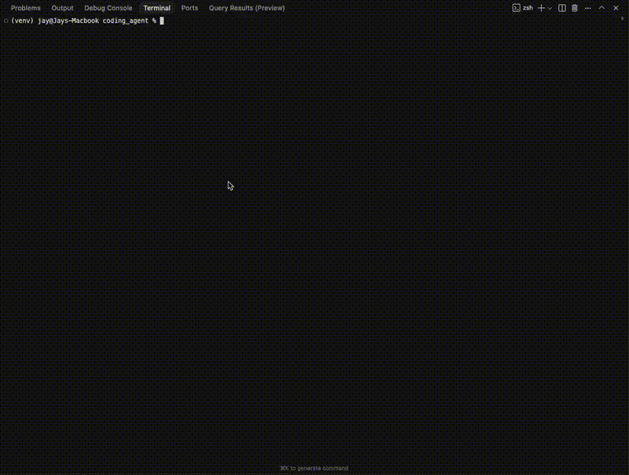
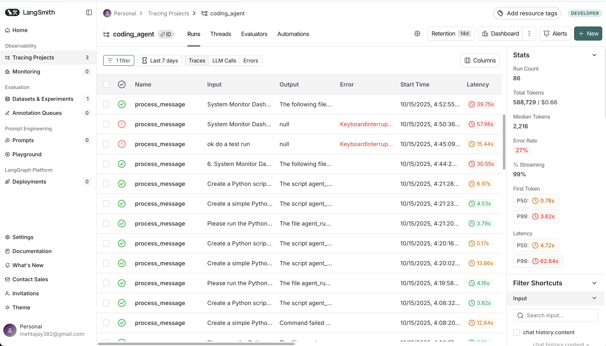

<p align="center">
  
</p>

<pre align="center" style="font-family: 'Courier New', monospace; font-size: 12px; line-height: 1.2; color: #1e3a8a; background: transparent;">
 █████╗  ██████╗ ███████╗███╗   ██╗████████╗ ██████╗ ██████╗ ██████╗ ███████╗
██╔══██╗██╔════╝ ██╔════╝████╗  ██║╚══██╔══╝██╔════╝██╔═══██╗██╔══██╗██╔════╝
███████║██║  ███╗█████╗  ██╔██╗ ██║   ██║   ██║     ██║   ██║██║  ██║█████╗  
██╔══██║██║   ██║██╔══╝  ██║╚██╗██║   ██║   ██║     ██║   ██║██║  ██║██╔══╝  
██║  ██║╚██████╔╝███████╗██║ ╚████║   ██║   ╚██████╗╚██████╔╝██████╔╝███████╗
╚═╝  ╚═╝ ╚═════╝ ╚══════╝╚═╝  ╚═══╝   ╚═╝    ╚═════╝ ╚═════╝ ╚═════╝ ╚══════╝
</pre>

<p align="center" style="color: #2563eb; font-size: 1.2em; font-weight: 600; margin-top: 10px;">
  The AI coding agent that understands your workspace!
</p>

<p align="center" style="color: #1e40af; font-size: 1.0em; font-weight: 500;">
  Real-time streaming, contextual awareness, and intelligent workspace management.
</p>

<p align="center" style="color: #374151; font-size: 0.95em;">
  <strong>AgentCode brings powerful AI coding assistance with LangChain, featuring real-time streaming, multi-file project support, and seamless Git integration.</strong>
</p>
<br>
<br>

[](https://pypi.org/project/langchain/) [](https://github.com/openai/openai-python/blob/main/LICENSE) [](https://github.com/langchain-ai/langchain) [](https://openai.com/) [](https://github.com/langchain-ai/langchain) [](https://git-scm.com/) [](https://nextjs.org/) [](https://smith.langchain.com/)

## Quick Start

1. **Install dependencies:**
   ```bash
   pip install -r requirements.txt
   ```

2. **Set your OpenAI API key:**
   ```bash
   export OPENAI_API_KEY="your-api-key-here"
   ```

3. **Configure your workspace (optional):**
   Create a `.env` file:
   ```bash
   WORKSPACE_PATH=/path/to/your/workspace
   DEFAULT_MODEL=gpt-4o-mini
   MODEL_TEMPERATURE=0.0
   MAX_HISTORY_MESSAGES=20
   COMMAND_TIMEOUT=30
   MEMORY_STORAGE_DIR=.agent_memory
   MAX_RETRY=3           # Maximum retry attempts (default: 3)
   AUTO_RETRY=true       # Enable auto-retry on errors (default: true)
   ```

4. **Run the agent:**
   ```bash
   # With streaming (default)
   python main.py
   
   # Without streaming
   python main.py --no-stream
   ```

## Features

### 🎯 **Core Capabilities**
- **File Operations**: Read, write, edit files with workspace awareness
- **Shell Commands**: Execute commands safely in workspace context
- **Multi-file Projects**: Create complete packages and applications
- **Code Testing**: Run tests, linting, and validation

### 🧠 **Intelligence Features**
- **Real-time Streaming**: Token-by-token streaming with live tool execution feedback
- **Contextual Awareness**: Remembers conversation history and file context
- **Smart Path Resolution**: Automatically handles file paths and workspace navigation
- **Multi-line Input**: Support for complex, multi-line requests
- **Session Management**: Persistent conversation history across sessions
- **Auto-Retry Logic**: Automatically recovers from errors by analyzing failures and trying different approaches (configurable up to 3 retries)

### 🛠 **Developer Experience**
- **Workspace Isolation**: All work happens in a dedicated workspace directory
- **Configuration Management**: Flexible settings via environment variables
- **Error Handling**: Graceful error recovery with detailed feedback
- **Rich CLI**: Clean, colored interface with helpful commands
- **Git Integration**: Create branches, commit changes, and push to remote repositories

### 🌐 **Web UI**
- **Modern Interface**: Next.js + FastAPI with real-time streaming
- **Two-Column Layout**: Chat + File Tree + Metrics in card-based design
- **Live Metrics**: Session stats with 2x2 grid (Turn, Messages, Files, Latency)
- **SSE Streaming**: Server-Sent Events for token-by-token updates
- **Session Controls**: Create, switch, and manage sessions visually

### 📊 **Evaluation & Observability**
- **LangSmith Integration**: Full tracing and evaluation framework
- **Rich Metadata**: Track latency, tool usage, session context, and success metrics
- **Test Suite**: 20+ test cases across 7 categories (CRUD, multi-file, error handling)
- **Custom Evaluators**: 7 specialized evaluation functions for agent performance
- **Smart Tagging**: Automatic categorization by task type, complexity, and tool usage

## Usage Examples

### **Simple File Operations**
```
You: Create a simple Python script that prints "Hello World"

Agent: I'll create a simple Python script for you.

✅ Created: hello.py
📝 Preview:
print("Hello World")

You: Run the script to test it

Agent: I'll run the script to test it.

⚡ Executed: python hello.py
📤 Output:
Hello World
```

### **Multi-file Project Creation**
```
You: Create a Python package called "calculator" with:
- __init__.py file
- calculator.py with Calculator class
- operations.py with basic math operations
- tests.py with unit tests
- requirements.txt

Agent: I'll create a complete calculator package for you.

✅ Created: calculator/__init__.py
✅ Created: calculator/calculator.py
✅ Created: calculator/operations.py
✅ Created: calculator/tests.py
✅ Created: calculator/requirements.txt

You: Add a modulo operation to it

Agent: I'll add the modulo operation to your calculator package.

✅ Updated: calculator/operations.py (added modulo function)
✅ Updated: calculator/calculator.py (added modulo method)
✅ Updated: calculator/tests.py (added modulo tests)

You: Test the package

Agent: I'll run the tests to verify everything works.

⚡ Executed: pytest calculator/tests.py
📤 Output: 7 tests passed!
```

### **Real-time Streaming**
```
You: Create a data pipeline script with pandas

Agent: [Processing...]

🛠️  Using tool: write_file
✅ Tool completed: write_file

I'll create a data processing pipeline script...
[Response streams token-by-token with real-time feedback]

You: Install the dependencies and run it

Agent: [Processing...]

🛠️  Using tool: write_file
✅ Tool completed: write_file

🛠️  Using tool: run_command
✅ Tool completed: run_command

Dependencies installed! The script is ready...
[Tokens appear as they're generated]
```

### **Advanced Features**
```
You: multiline
Multi-line input mode activated!
Enter your request (press Ctrl+D or type 'END' on a new line when done):
Create a Flask web application with:
- app.py (main Flask app)
- templates/index.html
- static/style.css
- requirements.txt
END

Agent: I'll create a complete Flask web application for you.

✅ Created: app.py
✅ Created: templates/index.html
✅ Created: static/style.css
✅ Created: requirements.txt
```

### **Git Integration**
```
You: Create a new calculator package and commit it to a branch

Agent: I'll create the calculator package and set up a Git branch.

✅ Created branch: agent/calculator
✅ Created: calculator/__init__.py
✅ Created: calculator/calculator.py
✅ Created: calculator/operations.py
✅ Staged all changes
✅ Committed: "Add calculator package with basic operations"

📊 Ready to push. The following commits will be pushed:
  a1b2c3d - Add calculator package with basic operations

May I push this branch to remote? (I'll wait for your confirmation)

You: Yes, push it

Agent: ✅ Pushed branch 'agent/calculator' to remote
```

## Available Commands

| Command | Description |
|---------|-------------|
| `help` | Show available commands |
| `sessions` | List available sessions |
| `session <id>` | Switch to a specific session |
| `info` | Show current session information |
| `config` | Show current configuration |
| `multiline` | Enter multi-line input mode |
| `clear` | Clear current session |
| `quit/exit` | Exit the agent |

### CLI Options

| Option | Default | Description |
|--------|---------|-------------|
| `--stream` | Enabled | Enable real-time streaming output |
| `--no-stream` | - | Disable streaming (traditional mode) |
| `--model <name>` | From config | Override model selection |
| `--session-id <id>` | New session | Resume specific session |

## Configuration Options

All settings can be configured via `.env` file or environment variables:

| Setting | Default | Description |
|---------|---------|-------------|
| `OPENAI_API_KEY` |  | OpenAI API Key |
| `WORKSPACE_PATH` | `./agent_runs` | Directory for all agent work |
| `DEFAULT_MODEL` | `gpt-4o-mini` | OpenAI model to use |
| `MODEL_TEMPERATURE` | `0.0` | Model temperature (0-1) |
| `MAX_HISTORY_MESSAGES` | `20` | Conversation history limit |
| `COMMAND_TIMEOUT` | `30` | Command execution timeout (seconds) |
| `MEMORY_STORAGE_DIR` | `.agent_memory` | Session storage directory |
| `GIT_ENABLED` | `true` | Enable Git operations |
| `GIT_AUTO_PUSH` | `false` | Auto-push without confirmation (not recommended) |
| `GIT_MAIN_BRANCH` | `main` | Protected main branch name |
| `LANGSMITH_TRACING` | `false` | Enable LangSmith tracing |
| `LANGSMITH_API_KEY` | - | LangSmith API key |
| `LANGSMITH_ENDPOINT` | `https://api.smith.langchain.com` | LangSmith API endpoint |
| `LANGSMITH_PROJECT` | - | LangSmith project name |

## Web UI

A modern web interface for the coding agent with real-time streaming and visual workspace management.

### Quick Start

**1. Start the Backend:**
```bash
cd web_ui/backend
source ../../venv/bin/activate  # or your venv path
python server.py
```
Backend runs on `http://localhost:8000`

**2. Start the Frontend:**
```bash
cd web_ui/frontend
npm install  # first time only
npm run dev
```
Frontend runs on `http://localhost:3000`

**3. Open in Browser:**
Navigate to `http://localhost:3000` and start chatting with the agent!

### Features

**Left Column - Chat Interface:**
- Real-time streaming responses (SSE)
- Token-by-token display with smooth updates
- Clean gradient message bubbles
- Session management controls
- Auto-scroll to latest messages

**Right Column - File Tree (Top):**
- Live workspace directory structure
- Expandable/collapsible folders
- File size display
- Auto-refresh every 3 seconds

**Right Column - Metrics Panel (Bottom):**
- **2x2 Grid Display**: Turn, Messages, Files, Latency
- Running average latency (last 10 responses)
- Real-time session statistics
- Auto-refresh every 2 seconds

### API Endpoints

- `POST /api/chat` - Stream agent responses (SSE)
- `GET /api/workspace/tree` - Get directory structure
- `GET /api/metrics/{session_id}` - Get session metrics
- `POST /api/sessions` - Create new session
- `GET /api/health` - Health check

See `web_ui/README.md` for detailed documentation.

## Evaluation & LangSmith

Comprehensive evaluation framework with LangSmith integration for tracing, metrics, and performance analysis.

<p align="center">
  
</p>

### Setup LangSmith

**1. Configure environment variables:**
```bash
LANGSMITH_TRACING=true
LANGSMITH_API_KEY=your-api-key
LANGSMITH_ENDPOINT=https://api.smith.langchain.com
LANGSMITH_PROJECT=coding_agent
```

**2. Create evaluation dataset:**
```bash
python evals/create_langsmith_dataset.py
```

**3. Run evaluations:**
```bash
python evals/run_evals.py
```

### Tracked Metrics

All agent runs are automatically tracked with rich metadata:

| Metric | Description |
|--------|-------------|
| `session_id` | Unique session identifier |
| `turn_number` | Current conversation turn |
| `message_count` | Total messages in session |
| `has_conversation_history` | Whether prior context exists |
| `files_in_context` | Number of files being tracked |
| `has_file_context` | Whether files are in context |
| `tool_call_count` | Number of tools used |
| `latency_seconds` | Response time |
| `success` | Whether operation succeeded |
| `model` | LLM model used |
| `temperature` | Model temperature |
| `input_length` | User input length |
| `response_length` | Agent response length |
| `error_type` | Error category if failed |

### Smart Tagging

Runs are automatically tagged by:
- **Task Type**: `file-operations`, `shell-commands`, `multi-file`, `git-operations`
- **Complexity**: `simple`, `moderate`, `complex`
- **Tool Usage**: `no-tools`, `single-tool`, `multi-tool`
- **Session State**: `first-turn`, `multi-turn`, `has-context`
- **Outcome**: `success`, `error-{type}`

### Test Coverage

**20+ Test Cases across 7 categories:**
1. Basic CRUD operations
2. Multi-file projects
3. Error handling
4. Complex workflows
5. Edge cases
6. Shell commands
7. Git operations

**7 Custom Evaluators:**
- File creation validation
- Content correctness
- Multi-file completeness
- Command execution success
- Error handling quality
- Git workflow validation
- Overall task success

See `evals/README.md` and `docs/langsmith_metrics.md` for detailed documentation.

## Project Structure

```
coding-agent/
├── src/
│   ├── agent.py          # Main agent logic with contextual awareness
│   ├── tools.py          # File/shell operations with workspace support
│   ├── git_tools.py      # Git operations (branch, commit, push)
│   ├── state.py          # State management & conversation types
│   ├── memory.py         # Session persistence & management
│   └── config.py         # Configuration management
├── interface/
│   └── cli.py            # Rich CLI interface with multi-line support
├── web_ui/
│   ├── backend/
│   │   ├── server.py     # FastAPI backend with SSE streaming
│   │   ├── test_server.py # Backend test suite
│   │   └── README.md     # Backend documentation
│   ├── frontend/
│   │   ├── app/          # Next.js app directory
│   │   ├── components/   # React components (Chat, FileTree, Metrics)
│   │   └── README.md     # Frontend documentation
│   └── README.md         # Web UI overview
├── evals/
│   ├── datasets/
│   │   └── test_cases.py # 20+ test cases across 7 categories
│   ├── create_langsmith_dataset.py # Upload test cases to LangSmith
│   ├── run_evals.py      # Execute evaluation suite
│   ├── evaluators.py     # Custom evaluation functions
│   └── README.md         # Evaluation documentation
├── docs/
│   ├── langsmith_metrics.md # LangSmith metrics documentation
│   └── streaming_guidelines.md # Streaming implementation guide
├── agent_runs/           # Default workspace directory
├── .agent_memory/        # Session storage
├── main.py               # CLI entry point
├── requirements.txt       
├── .env                  # Configuration file (optional)
└── README.md
```

## Key Improvements

### **Real-time Streaming**
- Token-by-token streaming for natural conversation flow
- Live tool execution feedback with emoji indicators (🛠️ ✅)
- Immediate visibility into agent's reasoning and actions
- Graceful fallback to non-streaming mode available

### **Contextual Awareness**
- Agent remembers conversation history and file context
- Understands references like "that file" or "operations.py"
- Maintains context across multi-turn conversations

### **Workspace Management**
- All files created in dedicated workspace directory
- Commands execute in workspace context automatically
- Clean separation between agent work and project files

### **Enhanced CLI**
- Multi-line input mode for complex requests
- Session management with persistent history
- Rich formatting and helpful commands
- Configuration display and management

### **Robust Error Handling**
- Graceful handling of file operations
- Detailed error reporting with suggestions
- Session state preservation on errors
- Timeout protection for long-running commands

### **Git Integration**
- Full version control from natural language
- Automatic branch creation with `agent/` prefix
- Safe commit workflow with diff preview
- Push protection - requires user confirmation
- Works with any Git repository (set via `WORKSPACE_PATH`)

## Development

This implementation follows the "Build Small, Ship Fast" philosophy with incremental enhancements:

- **Phase 1**: Basic CRUD operations ✅
- **Phase 2**: Contextual awareness ✅
- **Phase 3**: Workspace management ✅
- **Phase 4**: Enhanced CLI ✅
- **Phase 5**: Real-time streaming ✅
- **Phase 6**: Git integration ✅
- **Phase 7**: LangSmith evaluation framework ✅
- **Phase 8**: Web UI (Next.js + FastAPI) ✅
- **Phase 9**: Advanced features (future)

### **Technical Stack**

**Core Agent:**
- **Framework**: LangChain (AgentExecutor with tool calling)
- **Streaming**: LangChain's `astream_events()` API
- **State Management**: In-memory with JSON persistence
- **CLI**: Rich + Click with async support

**Web UI:**
- **Frontend**: Next.js 15, TypeScript, Tailwind CSS
- **Backend**: FastAPI, Uvicorn, Server-Sent Events (SSE)
- **Integration**: Reuses core agent logic from `src/`

**Evaluation:**
- **Tracing**: LangSmith with rich metadata and smart tagging
- **Testing**: Custom evaluators for 20+ test cases
- **Metrics**: Latency, tool usage, success rate, context tracking

See `coding-agent-design.md` for the full design document and roadmap.

## Troubleshooting

### **Common Issues**

**Command not found errors:**
- Commands execute in workspace directory by default
- Use relative paths from workspace (e.g., `pytest tests.py` not `pytest agent_runs/tests.py`)

**Interactive output not showing:**
- Progress bars and animations appear in your terminal, not in agent UI
- This is expected behavior for interactive terminal features

**Session context lost:**
- Use `sessions` command to list available sessions
- Use `session <id>` to switch to a specific session
- Each session maintains its own conversation history

**Configuration not loading:**
- Ensure `.env` file is in project root
- Check that environment variables are properly set
- Use `config` command to verify current settings

**Streaming issues:**
- If streaming appears slow or buffered, this is normal token-by-token behavior
- Use `--no-stream` flag if you prefer traditional batch responses
- Streaming requires async support (Python 3.7+)

**Git integration:**
- Agent works with the Git repository containing your workspace
- Set `WORKSPACE_PATH` to any directory inside your target Git repository
- Requires Git installed and configured with credentials (SSH keys or tokens)
- All commits use your local Git identity (from `~/.gitconfig`)
- To work with different repos, change `WORKSPACE_PATH` and restart the agent

**Web UI issues:**
- **Backend not starting**: Verify `.env` file has `OPENAI_API_KEY` and dependencies are installed
- **Frontend can't connect**: Ensure backend is running on port 8000 before starting frontend
- **CORS errors**: Backend must be on port 8000, frontend on port 3000
- **Streaming not working**: Check browser network tab for `text/event-stream` content type
- **Metrics not showing**: Send at least one message to create session data

**LangSmith tracing:**
- **No traces appearing**: Verify `LANGSMITH_TRACING=true` and `LANGSMITH_API_KEY` are set
- **Incomplete metadata**: Ensure you're using the latest version of the agent
- **Streaming runs failing**: Make sure message serialization is working (check `src/memory.py`)
- **Dataset creation fails**: Run `python evals/create_langsmith_dataset.py` from project root
